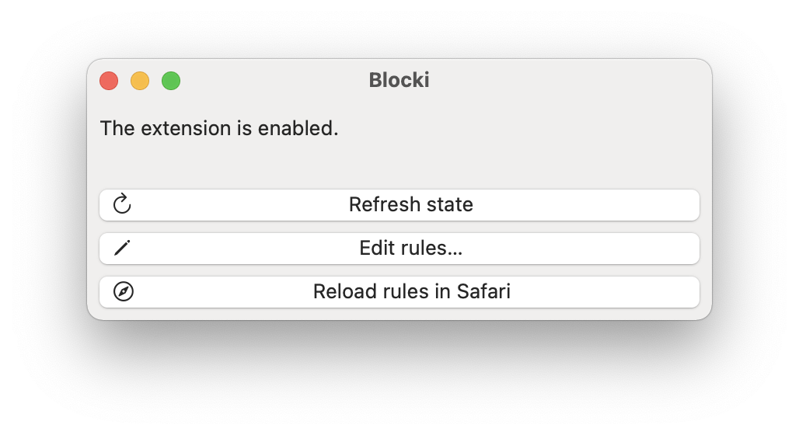

#  Blocki

A lot of websites out there have many minor annoyances. If you visit those websites frequently it drastically can reduce your browsing experience. With Blocki, you get control back and can manually specify rules of which content you want to load.

Many ad blockers for Safari only offer fixed filter lists. This is probably due to the fact that they are Content Blocker Extensions, where the filter lists are limited. Blocki's filtering is realized by a Content Blocker Extension as well, however, the rule set is loaded directly from a file, rather than being bundled with the application.

Note that Blocki aims to let you specify highly customized rules and should not be considered a general purpose ad blocker. Please use another available ad blocker for general purpose blocking in combination with Blocki, such as [Ka-Block!](https://github.com/dgraham/Ka-Block) or [Hush](https://github.com/oblador/hush).

For now, you can only edit rules by editing the rules directly as described in [Creating a Content Blocker](https://developer.apple.com/documentation/safariservices/creating_a_content_blocker).

