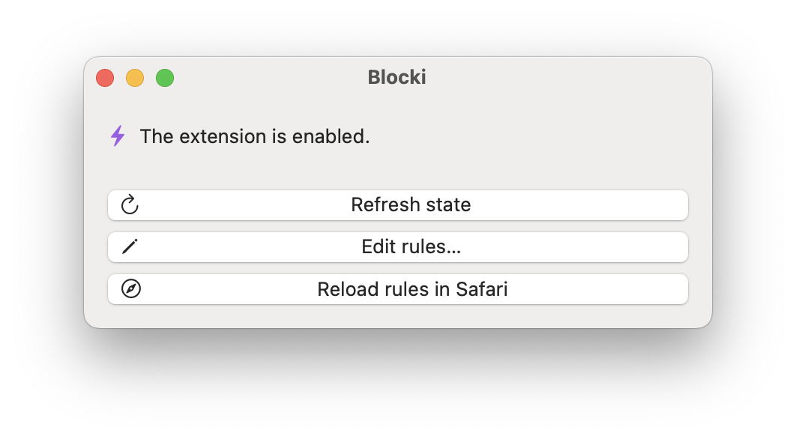

#  Blocki

A lot of websites out there have many minor annoyances. If you visit those websites frequently, it drastically can reduce your browsing experience. With Blocki, you get control back and can manually specify rules of which content you want to block or hide.

Most content blockers for Safari only offer fixed filter lists that are bundled with the application and lack any configuration. Blocki's aim is to grant you full control over the content-blocking rules. Blocki does not block any content by default.

For now, you can only edit rule set by modifying the `blockerList.json` file, as described in [Creating a content blocker](https://developer.apple.com/documentation/safariservices/creating_a_content_blocker).

Recommendation: Use Blocki in combination with other content blockers, such as [Ka-Block!](https://github.com/dgraham/Ka-Block) or [Hush](https://github.com/oblador/hush).
